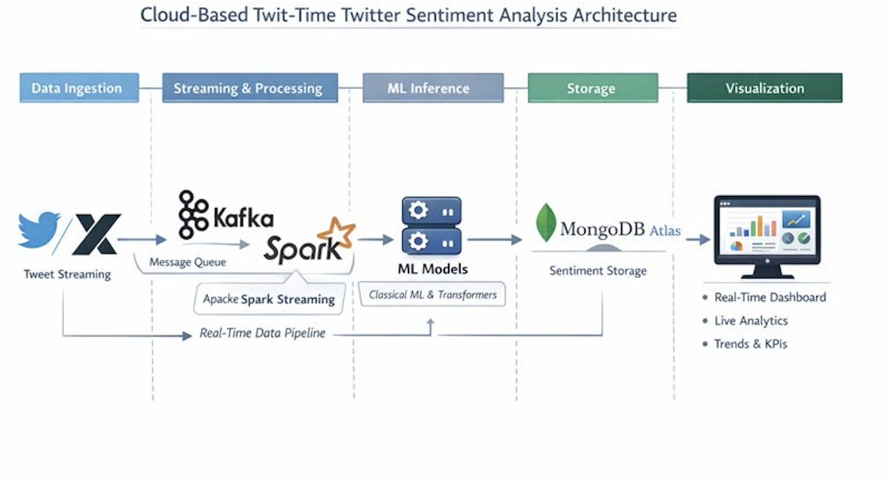
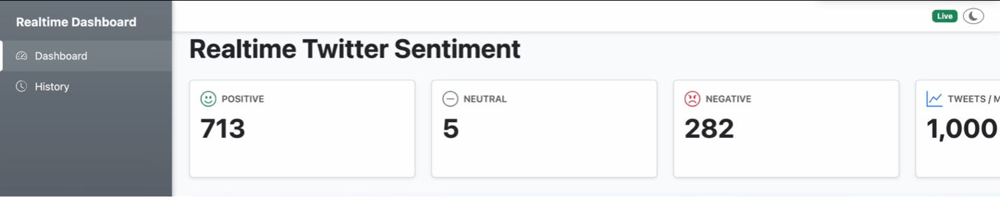
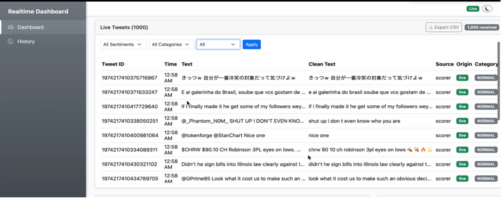
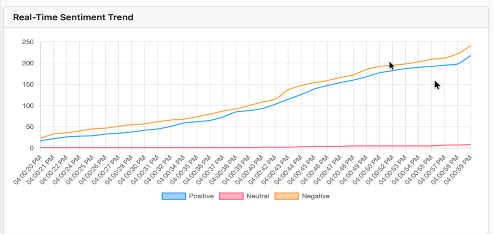
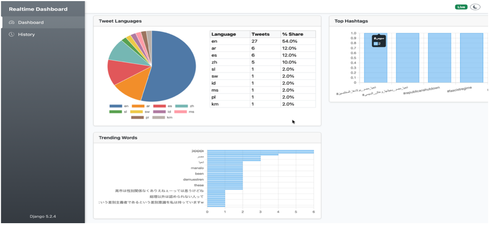
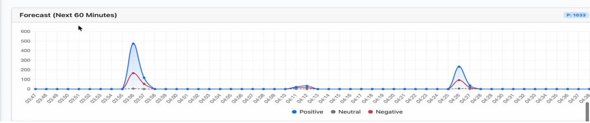
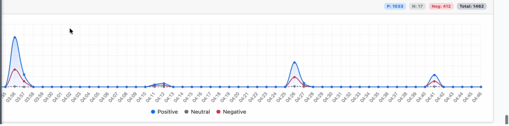
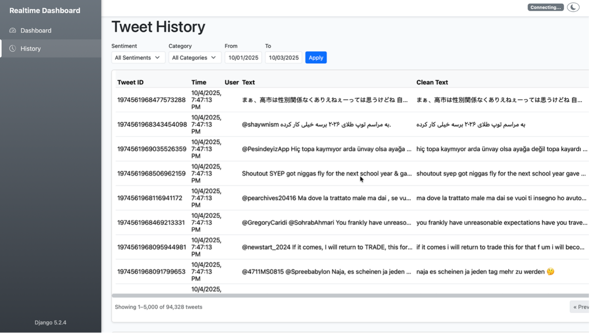
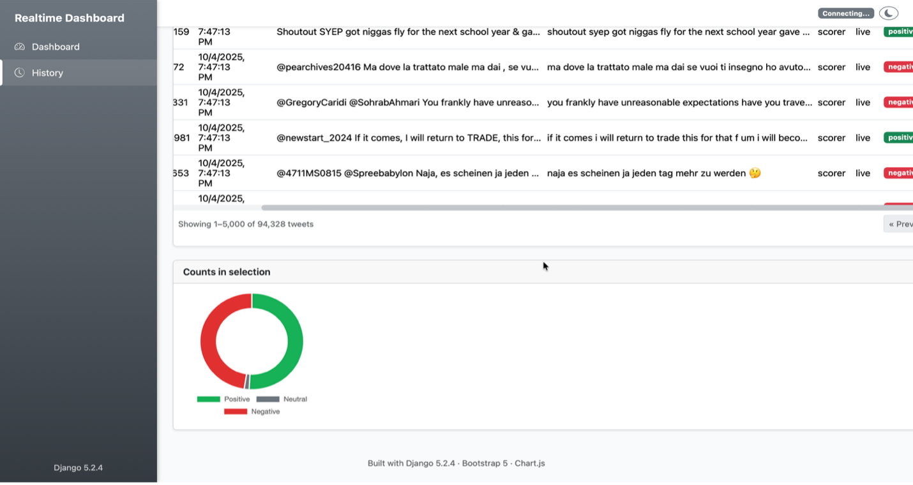

# Cloud-Based Real-Time Twitter Sentiment Analysis using Apache Kafka and Apache Spark

This project presents a cloud-based real-time multilingual Twitter/X sentiment analysis system. The system collects live tweets, processes them using big data streaming technologies, applies machine learning and transformer-based models for sentiment classification, and visualizes results through a real-time dashboard.

## Author
Yasmeen Azmat Ali  
MSc Artificial Intelligence  
University of West London  

## Project Overview
This research project designs and implements an end-to-end real-time sentiment analysis pipeline deployed on AWS EC2. The system integrates data ingestion, processing, storage, machine learning models, and visualization components in a scalable architecture.

## System Architecture
The pipeline consists of the following components:
- Twitter/X Scraper (Playwright)
- Apache Kafka for real-time message streaming
- Apache Spark Structured Streaming for data processing and ML inference
- MongoDB Atlas for storage
- Django + WebSocket (ASGI) for real-time dashboard visualization

## Real-Time Dashboard Demo

### Live Sentiment KPIs

### Live Tweet Streaming Table

### Real-Time Sentiment Trend Graph

### Language Distribution & Trending Hashtags

### Tweet Volume Forecasting Module

### Historical Tweet Explorer

  

## Technologies Used
- Python
- Apache Kafka
- Apache Spark Structured Streaming
- MongoDB Atlas
- Django (ASGI, REST APIs)
- Machine Learning (Logistic Regression, Random Forest, XGBoost, LightGBM)
- Transformer Models (BERTweet, XLM-RoBERTa)
- AWS EC2 (Ubuntu 24.04)
- Redis, Playwright, Chart.js

## Features
- Real-time tweet ingestion and processing
- Multilingual sentiment classification (English & Non-English)
- Hybrid hierarchical ML + Transformer model architecture
- Live dashboard with KPIs, sentiment trends, language distribution, and trending hashtags
- Forecasting module for tweet volume trends
- Fault-tolerant and scalable streaming pipeline

## Dataset
- Sentiment140 dataset (positive and negative)
- Large neutral tweet corpus
- Total dataset size: ~2.39 million tweets
- Three-class classification: Negative, Neutral, Positive

## Machine Learning Models
- Classical ML models: Logistic Regression, Random Forest, XGBoost, LightGBM
- Hybrid hierarchical models:
  - Stage 1: Classical ML neutral gate
  - Stage 2: Transformer polarity classifier (BERTweet / XLM-R)

## Deployment
The entire system was deployed on a single AWS EC2 instance with:
- Kafka broker
- Spark Structured Streaming jobs
- MongoDB Atlas integration
- Django ASGI real-time dashboard

## Results
The system achieved high accuracy and macro-F1 scores, with hybrid models outperforming classical ML models. Real-time processing latency was near real-time with fault tolerance via Spark checkpointing and Kafka buffering.

## Disclaimer
Due to privacy and size limitations, datasets and API keys are not included in this repository.

## Future Work
- Multilingual expansion with larger datasets
- Drift detection and model retraining automation
- Explainable AI dashboards
- Distributed multi-node deployment

## License
This project is for academic and research purposes.
